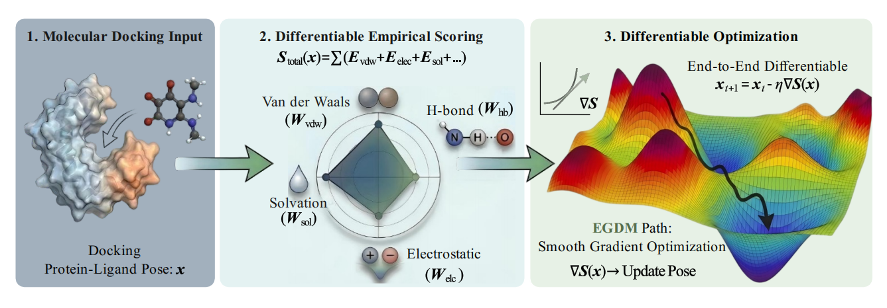

# TorchDock

<!-- Badges -->

[](https://pypi.org/project/torchdock/)
[](https://opensource.org/licenses/Apache-2.0)
[]()

> PyTorch-based Differentiable Molecular Docking Framework

TorchDock reimplements classical empirical scoring functions (Vina, Vinardo) as fully differentiable PyTorch versions, enabling end-to-end gradient-based conformational search. Compared to traditional discrete sampling methods, TorchDock achieves up to ~100x speedup in complex flexible docking scenarios (including protein side-chain flexibility), and provides an early-stopping based virtual screening pipeline that achieves ~5x acceleration while maintaining high recall rates for large-scale compound library screening.

<p align="center">
  
</p>

**[中文文档](README_CN.md)**

---

## Features

- Differentiable Vina / Vinardo scoring functions (pure PyTorch implementation)
- End-to-end gradient-based conformational search with SMAC global initialization
- Flexible docking: supports protein side-chain flexibility, ~100x speedup in high-dimensional scenarios
- Virtual screening with early stopping: XGBoost-based pre-scoring, ~5x acceleration
- Complete CLI toolchain: ligand/receptor preparation + docking + result conversion
- CPU / GPU heterogeneous computing support
- Plugin architecture for custom scoring functions

---

## Installation

TorchDock requires **Python ≥ 3.10** and **OpenBabel**.

### Step 1: Create conda environment and install OpenBabel

```bash
conda create -n torchdock python=3.12 -y
conda activate torchdock
conda install -c conda-forge openbabel -y
```

### Step 2: Install TorchDock

```bash
pip install torchdock
```

### CPU-only Installation (optional, saves disk space)

The default installation includes CUDA runtime libraries (~2GB). If you don't need GPU support, you can install the CPU version of PyTorch first to save space:

```bash
pip install torch --index-url https://download.pytorch.org/whl/cpu
pip install torchdock
```

### Install from Source

```bash
git clone https://github.com/Med4Everyone/torchdock.git
cd torchdock
pip install -e .
```

### Verify Installation

```bash
torchdock --help
```

Expected output:

```
TorchDock v0.1.0 — Differentiable molecular docking framework

Usage: torchdock <command> [options]

Commands:
  dock                 Run molecular docking.
  prepare_ligand       Convert SMILES or file input to PDBQT ligand.
  prepare_receptor     Prepare receptor PDBQT from a PDB file.
  define_box           Define a docking box from a ligand or manual coordinates.
  convert_result       Convert TorchDock PDBQT results to SDF and PDB.
  rmsd                 Calculate RMSD between docking poses and a reference.
```

---

## Quick Start

```bash
# 1. Prepare receptor
torchdock prepare_receptor -i protein.pdb -o receptor.pdbqt

# 2. Prepare ligand
torchdock prepare_ligand -smi "CC(=O)O" -o ligand.pdbqt  # from SMILES
# or
torchdock prepare_ligand -i ligand.mol2 -o ligand.pdbqt   # from file (mol2/sdf/pdb/mol)

# 3. Define docking box
torchdock define_box -l ligand.pdbqt -o box.json           # auto-compute center from ligand
# or
torchdock define_box -c 10.0 20.0 30.0 -s 25 25 25 -o box.json  # manual center and size

# 4. Run docking (semi-flexible / flexible)
torchdock dock -r receptor.pdbqt -l ligand.pdbqt -b box.json -o result.pdbqt
torchdock dock -r receptor.pdbqt -l ligand.pdbqt -b box.json -o result.pdbqt -f  # flexible

# 5. Convert results
torchdock convert_result -i result.pdbqt -o ./output
```

> See [example/](example/) directory for complete runnable examples.

---

## Fast Docking

TorchDock provides an early-stopping based fast docking mode (`--early_stop`) for initial screening of large compound libraries:

- **Truncated gradient optimization**: performs limited optimization steps on candidate molecules to quickly assess binding potential
- **XGBoost pre-scoring**: only candidates with the best predicted scores undergo full docking optimization
- **Efficiency gain**: achieves ~5x overall speedup compared to full-library docking while maintaining 80% recall rate for top-scoring molecules

> ⚠️ Note: In fast docking mode, most candidate molecules only receive predicted scores without full conformational optimization. Use results as initial screening reference, and perform standard docking on high-scoring molecules of interest.

```bash
# Enable fast docking mode
torchdock dock -r receptor.pdbqt -l ligand.pdbqt -b box.json -o result.pdbqt --early_stop
```

---

## CLI Reference

### `torchdock dock`

Run molecular docking.

```bash
torchdock dock -r receptor.pdbqt -l ligand.pdbqt -b box.json -o result.pdbqt
```

| Argument | Description | Required |
|----------|-------------|:--------:|
| `-r, --protein_pdbqt_path` | Receptor PDBQT file | ✅ |
| `-l, --ligand_pdbqt_path` | Ligand PDBQT file | ✅ |
| `-o, --output_path` | Output result file | ✅ |
| `-b, --box_file_path` | Box configuration JSON file | * |
| `-bc, --box_center X Y Z` | Box center coordinates | * |
| `-bs, --box_size DX DY DZ` | Box dimensions | * |
| `-c, --config_file_path` | Custom configuration file | |
| `-f, --flex` | Enable flexible docking | |
| `--flex_residues` | Flexible residues (e.g., `A:123,A:125`), auto-detect if not specified | |
| `-sc, --score_only` | Score only, no search | |
| `-es, --early_stop` | Enable early stopping | |
| `-d, --device` | Compute device (`cpu` / `cuda` / `cuda:0`) | |
| `-nw, --num_workers` | CPU worker processes (default: 4) | |
| `-v, --verbose` | Verbose output | |

> `*` Box definition: use `-b` for JSON file, or `-bc` + `-bs` for manual center and size (choose one).

### `torchdock prepare_ligand`

Convert SMILES or molecular files to PDBQT ligand.

```bash
# From SMILES
torchdock prepare_ligand -smi "CC(=O)Oc1ccccc1C(=O)O" -o ligand.pdbqt

# From file (mol2 recommended)
torchdock prepare_ligand -i molecule.mol2 -o ligand.pdbqt

# Batch conversion
torchdock prepare_ligand -b ligands.csv -o ./output_dir
```

| Argument | Description | Required |
|----------|-------------|:--------:|
| `-smi, --smiles` | SMILES string (single molecule) | * |
| `-i, --input` | Input file (mol2 recommended, also supports .pdb/.mol/.sdf) | * |
| `-b, --batch` | Batch CSV file (with ID and SMILES columns) | * |
| `-o, --output` | Output file or directory | ✅ |
| `-s, --seed` | Random seed (for 3D coordinate generation) | |
| `-d, --remove-h` | Remove hydrogen atoms | |

> `*` Choose one of three input methods.

### `torchdock prepare_receptor`

Prepare receptor PDBQT from PDB file.

```bash
torchdock prepare_receptor -i protein.pdb -o receptor.pdbqt
```

| Argument | Description | Required |
|----------|-------------|:--------:|
| `-i, --input` | Input PDB file | ✅ |
| `-o, --output` | Output PDBQT file | ✅ |
| `-d, --remove-h` | Remove hydrogen atoms | |
| `-nc, --no-clean` | Skip protein cleaning | |

### `torchdock define_box`

Define docking box.

```bash
# Auto-compute center from ligand
torchdock define_box -l ligand.pdbqt -o box.json

# Manual center specification
torchdock define_box -c 10.0 20.0 30.0 -s 25 25 25 -o box.json
```

| Argument | Description | Required |
|----------|-------------|:--------:|
| `-l, --ligand` | Ligand file (.mol2/.sdf/.pdb/.pdbqt, auto-compute center) | * |
| `-c, --center X Y Z` | Manual box center | * |
| `-s, --size SX SY SZ` | Box dimensions (default: 20 20 20) | |
| `-o, --output` | Output JSON file | ✅ |
| `-v, --visualize` | Generate box visualization PDB | |

> `*` Choose one: `-l` for auto-center from ligand file, or `-c` for manual coordinates.

### `torchdock convert_result`

Convert docking results to SDF and PDB formats.

```bash
torchdock convert_result -i result_remi.pdbqt -o ./output
```

| Argument | Description | Required |
|----------|-------------|:--------:|
| `-i, --input` | Result PDBQT file | ✅ |
| `-o, --output` | Output directory | ✅ |
| `-t, --top-k` | Convert only top k conformers | |

### `torchdock rmsd`

Calculate RMSD between docking results and reference conformation.

```bash
torchdock rmsd -p result.pdbqt -r reference.pdbqt
```

| Argument | Description | Required |
|----------|-------------|:--------:|
| `-p, --predicted` | Predicted result PDBQT | ✅ |
| `-r, --reference` | Reference structure PDBQT | ✅ |
| `-t, --top-k` | Calculate only top k conformers | |
| `-q, --quiet` | Quiet mode (only output RMSD values) | |

---

## Python API

TorchDock supports docking via Python code:

```python
from torchdock.pipeline.docking_runner import docking

# Basic docking
result = docking(
    protein_pdbqt_path="receptor.pdbqt",
    ligand_pdbqt_path="ligand.pdbqt",
    box_center=[15.0, 20.0, 25.0],
    box_size=[20.0, 20.0, 20.0],
    output_path="result.pdbqt",
)

# Returns: [torchdock_score, total_score, inter_score, intra_score, unbound_score]
print(f"TorchDock Score: {result[0]:.3f}")
```

Using configuration file:

```python
result = docking(
    protein_pdbqt_path="receptor.pdbqt",
    ligand_pdbqt_path="ligand.pdbqt",
    box_file_path="box.json",
    output_path="result.pdbqt",
    config_file_path="config.yaml",
    device="cuda",  # Use GPU
)
```

Flexible docking:

```python
result = docking(
    protein_pdbqt_path="receptor.pdbqt",
    ligand_pdbqt_path="ligand.pdbqt",
    box_center=[15.0, 20.0, 25.0],
    box_size=[20.0, 20.0, 20.0],
    output_path="result.pdbqt",
    flex=True,                          # Enable flexible docking
    flex_residues="A:123,A:125,B:45",   # Specify flexible residues (auto-detect if not specified)
)
```

---

## Citation

If TorchDock is helpful to your research, please cite:

```bibtex
@software{torchdock,
  title={Coming Soon},
  author={Coming Soon},
  year={2026},
  url={https://github.com/Med4Everyone/torchdock}
}
```

---

## Acknowledgments

TorchDock is jointly developed by the Alibaba Tongyi AI4S team and Professor Jian-Sheng Wu's group at China Pharmaceutical University, aiming to advance computational pharmaceutical research through open-source tools. Main contributors include Jingkun Hu, Junlong Liu, and Ji Ding.

## License

[Apache License 2.0](LICENSE)
